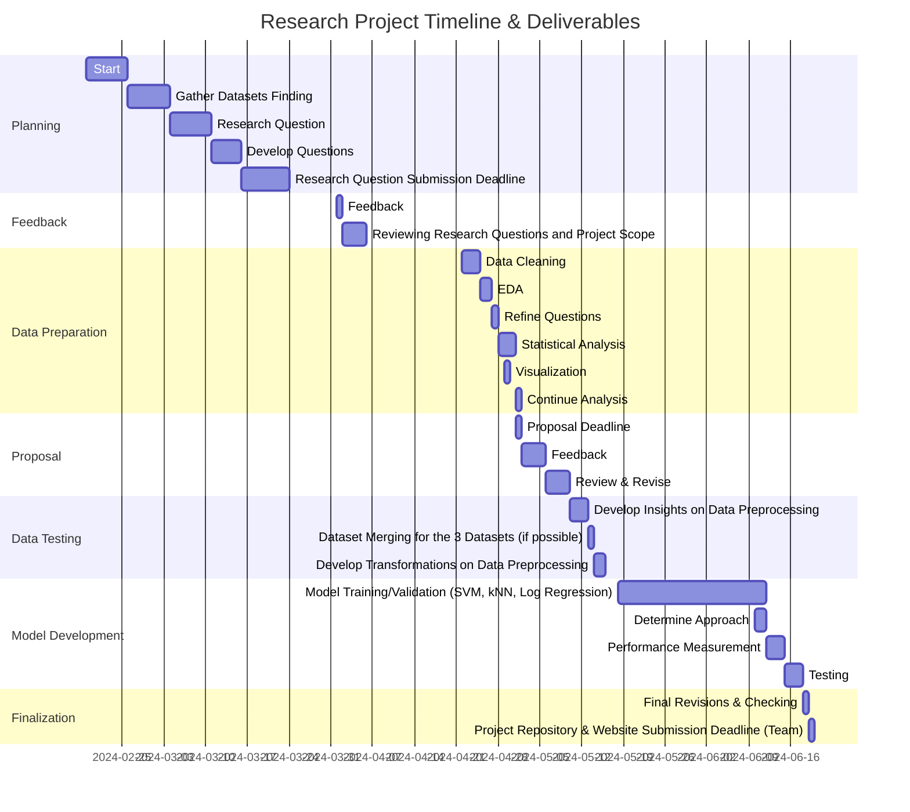

# Abstract
This research project delves into the complex interaction among economic circumstances, meat dietary behaviors, and health consequences across various global regions. By closely examining health data, income distributions, and meat consumption trends, the study aims to reveal the intricate relations contributing to differences in disease occurrence and mortality rates. The investigation seeks to offer a thorough understanding of how financial status and income differences impact health, highlighting inequalities in healthcare accessibility and disease burdens. Through precise examination, the project aims to address fundamental inquiries, such as the effects of meat preferences on longevity, and the potential association between air pollution and cancer incidence. By deciphering these multifaceted dynamics, the study's outcomes aspire to guide targeted initiatives in public health, optimize resource allocation, and foster enhanced global population health outcomes.

# Scope of the Project
The project focuses on investigating the effect of health statistics, income levels, and Meat dietary habits on the prevalence of infections and diseases leading to mortality across different regions globally. Specifically, it aims to analyze data to understand how socioeconomic factors contribute to health disparities and vulnerability to diseases. The scope includes examining various indicators such as healthcare access, income distribution, and dietary patterns to provide a holistic perspective on public health challenges.
Our project also aims to: 
- Understand how health statistics, income levels, and dietary options collectively influence regions' susceptibility to infections and diseases leading to mortality.
- Lead to insights into socioeconomic determinants of health, the impact of dietary patterns on disease prevalence, and the overall effectiveness of health infrastructure in different regions.
- Uncover disparities in disease burden, the effectiveness of healthcare interventions, and inform the prioritization of health resources based on region-specific health challenges.

# Research Questions
The main question we aim to approach is: _How can identifying health statistics, income statistics, and consumer MEat dietary options provide a broader perspective on regions that are more prone to infections and diseases resulting in mortality?”_

Additionally, the project aims to explore several other questions throughout the project, including but not limited to:

1. _What factors can contribute to the variations in Healthy Life Expectancy (HALE) at birth across different regions, countries, and levels of meat consumption?_
    + This question delves into the factors contributing to differences in healthy life expectancy at birth across various regions and countries. It explores how lifestyle, access to healthcare, environmental factors, and socioeconomic status impact HALE.
    + This research can uncover disparities in healthcare systems, lifestyle-related disease burdens, and policy implications for improving population health and longevity.
    + It also investigates whether there is a correlation between annual meat consumption and healthy life expectancy, exploring the impact of dietary habits on overall health and longevity.
2. _In areas with higher air pollution death rates, would it be logical to expect more occurrences of cancers?_
    + This question examines the potential correlation between air pollution levels and cancer rates, acknowledging the environmental influence on health outcomes.
    + Research findings can inform public health policies aimed at pollution control, cancer prevention strategies, and healthcare resource allocation based on environmental health risks.

# Methodolgy

## Data Preprocessing
Utilizing Jupyter Notebook, data preprocessing was performed on three main datasets identified as follows:

1. *World Health Statistics - Merged.ipynb*
2. *MeatConsumption-Preprocessing.ipynb*
3. *IncomeStats - Preprocessing.ipynb*

Each notebook aims to provide a comprehensive analysis of its respective dataset, ensuring that the preprocessing steps are well-documented and justified. The explanations and comments within the notebooks serve to enhance understanding and facilitate reproducibility of the preprocessing procedures.

1. Printed codes were utilized to display heads, info, column names, and dtypes, providing basic information on the data types. CSV files for world health statistics were merged. Additionally, merged_life_expectancy and merged_region_expectancy were combined as two separate entities due to differing locations—one was country-coded while the other was region-coded.

2. Missing values and duplicated rows were managed through merging, dropping, or imputation, depending on their significance and statistical descriptions. For instance, in the life expectancy data, missing values were checked, but no indication of their presence was found. In other cases, median values were employed for imputation where appropriate. Median imputation was specifically chosen due to its suitability for data with outliers, as the median is less influenced by extreme values compared to the mean. The preprocessing steps also included checking for and removing duplicate entries to prevent bias in the learning algorithms caused by training on repeated data.

3. While some outliers (such as NTDs) were not addressed in this step due to requiring further analysis, including more visualizations, transformations, or imputations, they were retained in their original state. Unnecessary columns were dropped, and certain variables, like the First Tooltip in some data frames, were numeric values that needed to be extracted from string fields using regular expressions—a crucial step in converting textual data into a format suitable for machine learning models.

4. Moreover, categorical variables were encoded, and training and testing splits were performed to prepare them for the subsequent model training step. Variables such as 'Location' and 'Indicator' were encoded using label encoding, converting categorical labels into numerical form without introducing a specific order to avoid increasing dimensionality.

5. Aside from the outliers issue, merging three datasets, as well as dataframes within the world health statistics dataset, seemed challenging.

6. Generation of charts and illustrations that possibly support or refute hypotheses or research questions. However, due to the size of the data and the numerous visuals, they have been generated in the respective notebooks accompanied by detailed explanations of the visuals and the corresponding results portrayed in them.
  + Some Examples:
    + 
      + + 
          
    + 
    + 
    + 

## Future works
The next step in our project involves determining whether the datasets can be merged. If not, we will proceed with training them separately and then conduct a combined analysis based on the outputs and models generated.

Following this, we will:

1. Gain additional insights through visualizations and data exploration to determine which necessary models, transformations, and feature scaling techniques should be applied.

2. Begin the model development phase, which includes model selection and training:
   - Choose appropriate machine learning models based on the data's nature and the specific health outcomes we aim to predict (such as mortality). Given the data's diversity (including mortality rates, health service access, etc.), models like logistic regression, random forests, and support vector machines could be considered. Transformation techniques, especially those targeting outliers, must be applied.
   - Utilize the training dataset to train using the best-fit models. The training process should be well-documented and repeated multiple times. Multiple models could be employed for comparison purposes (e.g., logistic regression, classification, etc.).

3. Evaluate the models and their training process thoroughly using validation techniques such as cross-validation, validation sets, and k-folds to assess how well they generalize to new, unseen data. After finalizing the model using the training and validation datasets, apply the model to a separate and untouched testing dataset to ensure unbiased performance evaluation. Evaluate the models using various performance metrics such as accuracy, precision, recall, F1 score, and AUC-ROC curves to determine their effectiveness in terms of error rate and balance between sensitivity and specificity. Aim for low train and test errors.

4. Use insights from the models to identify the most influential features in predicting the outcomes after training our data. This analysis can offer valuable insights into the factors driving health statistics like mortality rates or life expectancy.

5. Further refine the models by tuning hyperparameters to enhance their performance. This iterative process involves adjusting parameters such as learning rate, the number of trees in decision tree-based models, or kernel coefficients in SVMs.

# Datasets used
1. World Health Statistics 2020|Complete|Geo-Analysis

  + https://www.kaggle.com/datasets/utkarshxy/who-worldhealth-statistics-2020-complete

2. Global income statistics

  + https://www.kaggle.com/datasets/konradb/global-income-statistics 

3. Worldwide Meat Consumption

  + https://www.kaggle.com/datasets/vagifa/meatconsumption

# World Heath Statistics
## Merging dataframes except `merged_region_expectancy`
Five dataframes were merged except one because we couldn’t merge the region one so we kept it separate since this goes by region names and not country names.
The plots show that there are outliers with skewness of data as well as the correlation matrix indicates that there are no strong linear relationships between any pairs of variables in the dataset. The relationships that do exist are very weak, suggesting that the variables are largely independent of each other. The strongest correlation is -0.19 between Period and Indicator_encoded, but this is still considered weak.
Thus, outliers that fall out of the interquartile range were removed.

## Split & Scale Merged Data
1. splitting data: the data is divided into training 80% and testing 20% sets. X_train and y_train are used to train the model, while X_test and y_test are used to evaluate its performance.
Purpose: To divide the dataset into training and testing sets for model evaluation.
2. scaling data: The feature values in X_train and X_test are standardized, ensuring that all features contribute equally to the model's performance. 
purpose: To standardize the features to have a mean of 0 and a standard deviation of 1, which helps many machine learning algorithms perform better. 

## Cross Validation
Several Models were applied in the cross-validation process to evaluate the performances of models. The incentive is to find the best performing model that gives the lowest MSE and then train and test on that model. A baseline model was used as a benchmark in cross validation, training, and testing. The Merged Dataframe without Region consists of a large dataset so dimensionality reduction was applied using PCA on linear regression and SVM(RBF kernel) and compared to regular linear regression and SVM(RBF kernel) without DR.
The Region dataframe consists of one csv file with preprocessed data, thus explaining why the values are smaller than the other data frame.

### Cross Validation on the Merged Dataframe

We analyzed the performance of multiple machine learning models on the merged dataset, focusing on Linear Regression, Support Vector Machine (SVM) with different kernels, Random Forest, Gradient Boosting, and a baseline DummyRegressor. The data was initially divided into training and test sets, and scaling was used to normalize the training data to zero mean and unit variance. This preprocessing step assured good performance for models that are sensitive to feature scales, such as SVMs. The baseline model was used as a ben

The Linear Regression model was trained and analyzed using 5-fold cross-validation, which involved dividing the training data into five subsets, training the model on four subsets, and validating it on the remaining one. This process was repeated five times to ensure robust performance estimation, resulting in a mean cross-validation mean squared error (MSE) of 1584.02.

For the SVM models, three different kernels were explored: linear, polynomial, and radial basis function (RBF). The SVM with a linear kernel yielded a mean CV MSE of 1667.13, while the polynomial kernel SVM (degre 3) resulted in a mean CV MSE of 1612.66. The RBF kernel SVM involved a grid search over C and gamma parameters, identifying C=1 and gamma=1 as the best parameters with a mean CV MSE of 1519.39.

Principal Component Analysis (PCA) was applied to reduce the data's dimensionality, retaining 95% of the variance. Models were retrained on the PCA-transformed data, but the performance did not significantly improve, as evidenced by the nearly identical mean CV MSE for Linear Regression with and without PCA.

The Random Forest regressor was optimized using a grid search over parameters such as the number of estimators, maximum depth, and minimum samples required for splitting and leaf nodes. The best parameters (max_depth=20, min_samples_leaf=2, min_samples_split=5, n_estimators=100) resulted in a mean CV MSE of 460.82, demonstrating substantial predictive power. Similarly, the Gradient Boosting regressor was fine-tuned with a grid search, achieving a mean CV MSE of 480.52 with the best parameters (learning_rate=0.2, max_depth=5, min_samples_leaf=2, min_samples_split=2, n_estimators=200).

We can see that Random Forest and Gradient Boosting outperformed Linear Regression and SVMs, with Random Forest achieving the lowest mean CV MSE, indicating its robust predictive capabilities. Despite applying PCA, the original feature set sufficed for effective model training, underscoring the effectiveness of ensemble approaches in this context.

### Cross Validation for `merged_region_expectancy`

+ We further evaluated the performance of these machine learning models focusing on merged regional expectancy. The models included Random Forest, Gradient Boosting, and Support Vector Regressor (SVR), alongside the baseline DummyRegressor. Data preprocessing involved scaling the training data to standardize it, ensuring optimal performance for the models. 

+ A Random Forest regressor was configured with the optimal hyperparameters (max_depth=20, min_samples_leaf=2, min_samples_split=5, n_estimators=100) determined through prior tuning. Using 5-fold cross-validation, the model achieved a mean cross-validation mean squared error (MSE) of 21.70, indicating its accuracy.

+ An initial Gradient Boosting model with parameters (n_estimators=100, learning_rate=0.1, max_depth=3) was evaluated, yielding a mean CV MSE of 7.56. To refine this model, a grid search was conducted over a parameter grid, resulting in the best configuration (learning_rate=0.1, max_depth=3, min_samples_leaf=1, min_samples_split=2, n_estimators=200). This optimized Gradient Boosting model significantly outperformed the initial model, achieving a mean CV MSE of 7.11.

+ An SVR with an RBF kernel was evaluated using optimal parameters (C=1, gamma=1, epsilon=0.01). The SVR's mean CV MSE was 27.90, indicating that while it performed reasonably well, it was less effective compared to the Random Forest and Gradient Boosting models.

+ A Dummy Regressor with the 'mean' strategy served as the baseline model. This model produced a mean CV MSE of 26.86, providing a reference point to assess the relative performance of the other models. This model 

+ Gradient Boosting model with optimized parameters demonstrated the best performance with the lowest mean CV MSE of 7.11, highlighting its superior predictive capabilities for the dataset. The Random Forest model also performed well, whereas the SVR and Dummy Regressor lagged behind.

## Train
Based on these comparisons, the Random Forest and Gradient Boosting models are clearly outperforming the other models like Linear Regression and SVM(linear, polynomial, and RBF).

Additionally,  baseline model was used as a benchmark to compare cv mses with the mean predictor 1732.45013 for merged dataframe and 26.86463 for merged_region_expectancy) and proved that Random Forest and Gradient Boosting are better.
Both models are strong candidates for final model selection.

However, the Random Forest model has a slightly better CV MSE compared to Gradient Boosting in the MERGED DATAFRAME in which Best Gradient Boosting CV MSE: 480.52322 and Best Random Forest CV MSE: 460.82440.
Random Forest Mean CV MSE with merged_region_expectancy: 21.70019 and Gradient Boosting Mean CV MSE with merged_region_expectancy: 7.56040.
Gradient Boosting will be chosen for both datasets because: 
1. It has a significantly lower CV MSE for the merged region expectancy data. 
2. Its performance on the merged dataframe is very close to that of Random Forest, with only a small difference in CV MSE.
3. Gradient Boosting is often more robust and provides better generalization performance
Hence, initialised Gradient Boosting with the best hyperparameters and then fit on the train data and then predict to calculate test. 

#### Analysis on Model Performance: Train & Test Results
1. Merged Dataframe without Region
Mean Squared Error (MSE):
The MSE of 473.68957 indicates that the model has moderate error in its predictions. While this is not exceedingly high, there is room for improvement.
Mean Absolute Error (MAE):
The MAE of 15.61887 suggests that, on average, the model's predictions are off by approximately 15.6 units, which indicates moderate prediction accuracy.
R²:
An R² value of 0.72224 means that the model explains about 72.2% of the variance in the target variable. This indicates a good fit, but there is still 27.8% of the variance that is unexplained.
2. Merged Region Dataframe
Mean Squared Error (MSE):
The MSE of 2.71476 is very low, suggesting that the model has high accuracy in its predictions.
Mean Absolute Error (MAE):
The MAE of 1.24276 indicates that, on average, the model's predictions are very close to the actual values.
R²:
An R² value of 0.46612 means that the model explains approximately 46.6% of the variance in the target variable. While this is moderate, it suggests that there is significant unexplained variance. That is probably due to the small dataframe.

#### Analysis Based on Figures

1. Merged Dataframe without Region
+ Residuals Plot:
++ Observation: The residuals are scattered around the zero line, indicating that the model has captured the underlying pattern fairly well. However, there are some outliers and a funnel shape, suggesting heteroscedasticity (variance of errors is not constant). This is due to the large data, thus applying polynomial feature expansion later might address this. Applying log transformation did not deal with the outliers and skewness so opted against. 
++ Implication: The model's predictions are generally accurate but may struggle with certain ranges of the target variable, especially with higher values where residuals are larger.

+ Actual vs Predicted Plot:
++ Observation: The points are closely clustered around the diagonal line, showing a strong correlation between actual and predicted values.
++ Implication: The model predicts the target variable with good accuracy. The spread around the line indicates minor deviations between actual and predicted values.

2. Merged Region Dataframe
+ Residuals Plot:
++ Observation: The residuals show more scatter and less concentration around the zero line compared to the merged dataframe without the region. There are noticeable outliers.
++ Implication: The model's predictions have some error variance that is not constant across all values, indicating possible areas for improvement in capturing the target variable's behavior.
Actual vs Predicted Plot:
Observation: The points are somewhat dispersed around the diagonal line, indicating a moderate correlation between actual and predicted values. The dispersion suggests that while the model is reasonably accurate, there is room for improvement.
Implication: The model's predictive accuracy is moderate. The spread indicates that some predictions are further from the actual values, which might be improved by further tuning or incorporating additional features.

* For the Merged Dataframe without Region:
The Gradient Boosting model demonstrates a good fit with an R² value of 0.722 and reasonable error metrics. This model could be considered robust for predicting the target variable in this context.

* For the Merged Region Dataframe:
The Gradient Boosting model has very low MSE and MAE, indicating high prediction accuracy. However, the R² value of 0.466 suggests that there is still substantial variance that the model does not explain. This could be improved with further feature engineering or by incorporating additional relevant features.
However, Gradient Boosting seems to be performing well in both dataframes give low MSE error, lower than in cross validation and baseline models. 

* For Merged Dataframe without Region:
The Gradient Boosting model is performing well, with relatively high accuracy and good predictive performance. The residuals and actual vs predicted plots both suggest that the model captures the underlying pattern well, despite some heteroscedasticity.

* For Merged Region Dataframe:
The model shows reasonable accuracy but could benefit from further tuning. The residuals plot indicates some variance in errors, and the actual vs predicted plot suggests that the model's predictions could be more tightly clustered around the actual values.

- For Merged Dataframe without Region:
    - This model can be used for final predictions as it performs well. Consider addressing heteroscedasticity if further refinement is needed.

- For Merged Region Dataframe:
    - Perform further validation and potentially add more features or refine existing ones to improve model performance.
    - Investigate possible reasons for higher residuals and work on reducing prediction errors, especially for higher values of the target variable.

This combined analysis provides a holistic view of the model performance based on the provided figures and statistical metrics. Based on the results, the models do not seem to be overfitting, as the cross-validated MSEs are close to those of the test set. The similar performance on cross-validation and test sets indicates that the model generalizes well to unseen data, which is a desirable property in machine learning models. The slight differences in MAE and R-squared values are expected due to the natural variability between different data samples.

#### Feature Importances
1. **Location_encoded:**
   - **Importance:** 0.48414
   - **Analysis:** This feature is by far the most important, contributing nearly half of the total importance. This indicates that the geographic location plays a crucial role in predicting the target variable, likely due to the significant regional differences in health outcomes and socioeconomic conditions.

2. **Life expectancy:**
   - **Importance:** 0.15817
   - **Analysis:** This is the second most important feature, suggesting that the overall life expectancy in a region significantly influences the model’s predictions. Higher life expectancy is generally associated with better health outcomes and living conditions.

3. **Period:**
   - **Importance:** 0.12891
   - **Analysis:** The period or time variable is also quite significant, reflecting temporal changes and trends in health statistics and socioeconomic factors over different years.

4. **Indicator_encoded:**
   - **Importance:** 0.10751
   - **Analysis:** This feature, which could represent various health indicators or metrics, shows a moderate level of importance, indicating that specific health metrics are relevant in predicting the target variable.

5. **Hres.
ale Expectancy:**
   - **Importance:** 0.10539
   - **Analysis:** Healthy Life Expectancy (HALE) is also a moderately important feature, emphasizing the relevance of the quality of life and health-adjusted life years in the model's predictions.

6. **% OF HALE in life expectancy:**
   - **Importance:** 0.01589
   - **Analysis:** This feature has the least importance, suggesting that while the proportion of HALE in overall life expectancy is somewhat relevant, it is not a major driver in the model’s predictive performance compared to other feature

#### Feature Importance Insights

The feature importance analysis highlights the critical role of geographic location and overall life expectancy in predicting health outcomes. Temporal factors and specific health indicators also contribute significantly, while the proportion of HALE in life expectancy is less impactful. This insight can guide further analysis and model refinement, emphasizing the need to consider regional differences and temporal trends in health data.

+ **Prioritize Location and Life Expectancy:** Focus on these key features for better predictive accuracy.

+ **Monitor Temporal Changes:** Continuously update models with new data to capture trends.

+ **Enhance Health Indicators:** Include more detailed health metrics to improve model performance.

+ **Refine HALE Data Usage:** Use HALE data to provide additional context and depth.

# IncomeStats Data Set

## Dealing with Outliers
The histogram indicates a skewed income distribution with most values on the lower end, while the scatter plot reveals a weak or complex relationship between GDP per capita and net income. This implies that factors other than GDP might significantly influence net income, highlighting the need for a more detailed analysis to understand the underlying dynamics. So, further preprocessing was done in which outliers were removed and label encoder was used instead of one hot to directly transforms categorical data into integers, which requires less memory compared to creating multiple binary columns for each category in one-hot encoding. 

### Income Distribution:

The histogram shows a right-skewed distribution for Income..net., indicating that most values are concentrated at the lower end of the range.
There are some high-income outliers.

Scatter Plot of _GDP vs. Income_:
The scatter plot shows a dense cluster of points with GDP PPP per capita (2011 USD) and Income..net.
Most points are concentrated at lower GDP and income levels, with a few high-income outliers.

Box Plots:
Income..net.: The box plot shows a distribution with a few outliers at the high end.
GDP PPP per Capita: The box plot indicates a wide range of GDP values, with several high outliers.

Correlation Matrix:
The correlation matrix indicates a weak positive correlation (0.10) between GDP PPP per capita and Income..net.
The diagonal elements are 1, as expected, indicating perfect correlation with themselves. The weak positive correlation between Income..net. and GDP PPP per capita suggests that while there is some relationship, it is not strong. This could indicate other factors at play affecting income beyond just GDP.

Descriptive Statistics:
GDP PPP per capita:
Mean: $7,517.81
Std Dev: $6,263.67
Range: 505𝑡𝑜25,112.48
Income..net.:
Mean: 0.074
Std Dev: 0.042
Range: 0 to 0.199

## Split & Scale

- The dataset is split into training and testing sets, with 80% of the data used for training and 20% for testing.
- The feature matrix `X` and target vector `y` are confirmed to have the expected dimensions.
- After the split, the training set has 47192 samples and the testing set has 11798 samples, each with 3 features.

This confirms that the data splitting and preprocessing steps were successful.

## Cross Validation
A baseline model was used again as a benchmark.
### Without Polynomial Features:
- Linear Regression Mean CV MSE: 0.00166
- Gradient Boosting Mean CV MSE: 0.00166
- XGBoost Mean CV MSE: 0.00170
- Random Forest Best CV MSE: 0.00173

### With Polynomial Features:
- Linear Regression Mean CV MSE with Polynomial Features: 0.00167
- Gradient Boosting Mean CV MSE with Polynomial Features: 0.00167
- XGBoost Mean CV MSE with Polynomial Features: 0.00167
  
## After Principal Component Analysis (PCA):
- Linear Regression Mean CV MSE after PCA: 0.00167
- Gradient Boosting Mean CV MSE after PCA: 0.00168
## SVM Models:
- SVM (Linear Kernel) Mean CV MSE: 0.00234
- SVM (Polynomial Kernel) Mean CV MSE: 0.00174
Best SVR parameters ('C': 1, 'gamma': 0.1): Mean CV MSE: 0.00174

# Summary of Results:
## Linear Regression:
- Without Polynomial Features: 0.00166 (Best Linear Regression performance)
- With Polynomial Features: 0.00167
- After PCA: 0.00167

## Gradient Boosting:
- Without Polynomial Features: 0.00166 (Best Gradient Boosting performance)
- With Polynomial Features: 0.00167
- After PCA: 0.00167
  
## XGBoost:
- Without Polynomial Features: 0.00166 (Best XGBoost performance)
- With Polynomial Features: 0.00167
  
## Random Forest:
Without Polynomial Features: 0.00172

## SVM Models:
- SVM (Linear Kernel): 0.00234
- SVM (Polynomial Kernel): 0.00174
- Best SVR parameters ('C': 1, 'gamma': 0.1): 0.00174

## Analysis:
- Best Overall Model: The best performing model overall is Gradient Boosting without Polynomial Features with a CV MSE of 0.00166.
- Linear Regression: The best Linear Regression performance is without polynomial features (0.00166), closely followed by with PCA (0.00167).
- XGBoost: The best XGBoost performance is without polynomial features (0.00166).
- Random Forest: The Random Forest model without polynomial features has a CV MSE of 0.00172, which is higher than the best performances of Linear Regression, Gradient Boosting, and XGBoost.
- SVM Models: The best SVM performance is with the Polynomial Kernel (0.00174), but it is still higher than the best Linear Regression, Gradient Boosting, and XGBoost performances.

## Conclusion of Analysis:
The Gradient Boosting model without polynomial features has the lowest CV MSE and is the best performing model among those compared. Adding polynomial features or applying PCA did not significantly improve the performance for most models. The SVM models, while competitive, did not outperform the tree-based models or linear regression in this case. The Random Forest model also performed well but did not beat the best Gradient Boosting or Linear Regression performances. 
Also Cross-Validation MAE: 0.03316 and Cross-Validation R-squared (R²): 0.05946 for Gradient Boosting were calculated.

## Training
Due to the best performance also compared to the baseline model(0.00177), Gradient Boosting performs best. So, continued to train and test using Gradient Boosting.

Summary of Performance Metrics:
Mean Squared Error (MSE): 0.00168
Mean Absolute Error (MAE): 0.03343
R-squared (R²): 0.06218

Analysis:
MSE (Mean Squared Error): This is a measure of the average squared difference between the actual values and the predicted values. A lower value indicates better performance, with your model achieving an MSE of 0.00168.
MAE (Mean Absolute Error): This metric measures the average magnitude of the errors in a set of predictions, without considering their direction. The MAE for your model is 0.03343.
R² (R-squared): This metric indicates the proportion of the variance in the dependent variable that is predictable from the independent variables. An R² value of 0.06219 indicates that the model explains approximately 6.22% of the variance in the test data.
Analysis of Model Performance:
Gradient Boosting Model:
Mean CV MSE vs. Test Set MSE:
Mean CV MSE: 0.00166
Test Set MSE: 0.00168
The cross-validated MSE and the test set MSE are very close, suggesting that the model generalizes well to unseen data. This indicates that the model is not overfitting.
R-squared (R²): 0.06218
The R² value is relatively low, indicating that the model explains only about 6.20% of the variance in the test data. This indicates that the model might not be capturing all the underlying patterns in the data, and there could be other significant predictors not included in the current feature set.

Baseline Model:
Test Set MSE: 0.00179
The baseline model's MSE is higher than the Gradient Boosting model's MSE, indicating that the Gradient Boosting model performs better than simply predicting the mean. However, the improvement is modest.

## Conclusion of Training:
Based on the results, the models do not appear to be overfitting since the cross-validated MSEs are close to the test set MSEs. Generalization: The similar performance on cross-validation and test sets shows that the model generalizes well to unseen data, which is a desirable property in machine learning models. The slight difference in MAE and R-squared values is expected due to the natural variability between different data samples.
Overall, these comparisons indicate that the Gradient Boosting model trained with the best hyperparameters found through GridSearchCV is robust and generalizes well to new data.

## Nature of the Dataset
Based on the performance of the models and the evaluation metrics provided, we can draw some conclusions about the nature of the dataset:
Complexity and Variability:
The relatively low R-squared (R²) value of 0.0621 for the Gradient Boosting model suggests that the dataset has a lot of variability that the model is not capturing. This indicates that the relationship between the input features (Age, Income, Education) and the target variable (Spending) is not straightforward or is influenced by other factors not included in the model.
Predictive Power:
The models' MSE values are close to each other, and the Gradient Boosting model shows only a modest improvement over the baseline model. This suggests that the input features used may not have strong predictive power for the target variable. There may be other important features not captured in the current dataset that could better explain the variance in Spending.
Model Generalization:
The close Mean CV MSE and Test Set MSE for the Gradient Boosting model indicate that the model generalizes well to unseen data. This suggests that the model is not overfitting and is consistent in its predictions across different data splits.
Baseline Comparison:
The baseline model's performance is relatively close to the Gradient Boosting model, which highlights that the improvement gained from using more complex models is modest. This again points to the possibility that additional or more relevant features could significantly improve model performance.

## Conclusion for the Nature of the Dataset
Based on the analysis and visualizations, the Gradient Boosting model performs better than the baseline model and other models in terms of Mean CV MSE and Test Set MSE. However, the relatively low R-squared value indicates that the model is not capturing all the variability in the target variable. This suggests that there might be additional features or more complex interactions within the data that are not being captured by the current model. Further feature engineering and exploration of additional data could help improve the model's predictive power.

- Income Distribution:
    - The histogram shows a right-skewed distribution for Income..net., indicating that most values are concentrated at the lower end of the range.
    - There are some high-income outliers

- Scatter Plot of _GDP vs. Income_:
    - The scatter plot shows a dense cluster of points with GDP PPP per capita (2011 USD) and Income..net.
    - Most points are concentrated at lower GDP and income levels, with a few high-income outliers.

The Actual vs. Predicted plot shows that the Gradient Boosting model's predictions are generally lower than the actual values, with a dense clustering of points within a specific range.
The Residuals plot indicates heteroscedasticity, suggesting that the model's prediction errors are not uniformly distributed and are larger for certain predicted values.
These observations suggest that while the Gradient Boosting model performs reasonably well within a specific range, it may benefit from further tuning or the inclusion of additional features to improve its predictions, particularly for values outside the dense cluster range.

## Analysis of Feature Importances from Gradient Boosting Model 
Based on the feature importance plot provided by the Gradient Boosting model, we can draw the following conclusions about the relative importance of the features in predicting the target variable (likely some measure of economic performance or inequality, given the feature names):

- Gini Recalculated Encoded:
Importance: 0.995693
Interpretation: This feature has an overwhelmingly high importance compared to the other features. It suggests that the 'gini_recalculated_encoded' variable is the most critical factor in predicting the target variable. The Gini coefficient is a measure of income inequality, so this result indicates that income inequality is the primary driver in the model's predictions.

- _GDP PPP per Capita (2011 USD)_:
Importance: 0.002844
Interpretation: This feature has a very low importance relative to the Gini coefficient. It suggests that GDP per capita (adjusted for purchasing power parity) does not play a significant role in the model's predictions. This might be surprising in economic analyses, as GDP per capita is usually a strong indicator of economic performance. However, in this context, it appears to be less relevant.
- Country Encoded:
Importance: 0.001463
Interpretation: This feature also has very low importance. It suggests that the country identifier (likely a categorical variable that has been encoded) does not contribute much to the model's predictions. This could imply that country-specific effects are either minimal or already captured by the other variables, particularly the Gini coefficient.

### Feature Importance Insights:
The overwhelming importance of the 'gini_recalculated_encoded' feature suggests that inequality is a critical factor in the model's predictions. This aligns with economic theories where income inequality can have significant impacts on various economic outcomes.
The low importance of GDP per capita (PPP) is unexpected, as it is typically a strong indicator in economic models. This could imply that in this specific dataset or context, income inequality is a more direct driver of the target variable.
The minimal importance of the country identifier suggests that the model's predictions are not heavily influenced by country-specific effects, or these effects are already captured by other variables like the Gini coefficient.

# Meat Consumption

## Project Overview

This section aims to analyze and compare different regression models on two datasets derived from meat consumption data. The original dataset, `dMeat`, was split into two subsets: `dMeat1` and `dMeat2`.

## Datasets

- **`dMeat1`**: Represents all countries excluding aggregated regions such as European countries EU28, BRICS, etc.
- **`dMeat2`**: includes Aggregated regions only.

+ The pie chart shows the percentage of each meat type in total value. Pork makes up the largest portion of the chart at 40.6%. Poultry comes in second at 34%, followed by beef at 20.8%, and sheep at 4.6%. Pork and Poultry occupy the majority of the data with sheep being in the minority. But after removing the outliners, this data was more standartized which each type having close percentages.

### Outlier Handling

Upon investigating outliers in `dMeat1` and `dMeat2`, both datasets showed significant outliers:
- In `dMeat1`, outliers were retained as they reflect the actual meat consumption results for Korea.
- In `dMeat2`, outliers were removed because they represented aggregated world data (WLD), which is irrelevant to our model.

### Label Encoding
Label encoding was applied to both datasets, resulting in:
- **`dMeat1_encoded`**: Encoded categorical features, including outliers.
- **`dMeat2_clean`**: Cleaned and preprocessed features, excluding outliers.

+ The pie chart shows the percentage of each meat type encoded in total value.
### Log Transformation

Since the boxplots of both datasets still showed outliers after initial preprocessing, a log transformation was applied to handle outliers and address distribution abnormalities.

### Preprocessing and Correlation Analysis

After preprocessing and log transformation, correlation analysis was conducted again on both datasets.

## Model Training and Evaluation

The following models were trained and evaluated:

1. **Linear Regression**
2. **Support Vector Machine (SVM)**
   - Linear Kernel
   - Polynomial Kernel
   - RBF Kernel
3. **Random Forest**
4. **Gradient Boosting**
5. **Baseline Mean Predictor**

The performance of these models was assessed using cross-validation, with the mean cross-validated mean squared error (MSE) serving as the primary evaluation metric.

## Analysis of Results
## Analysis of Model Performance

### `dMeat1_encoded` Dataset
- Linear Regression: Mean CV MSE = 2.66025
- SVM (Linear Kernel): Mean CV MSE = 2.67684
- SVM (Polynomial Kernel): Mean CV MSE = 2.37474
- SVR Best Parameters: C = 1, gamma = 1, Mean CV MSE = 2.19777
- Random Forest Best Parameters: {'max_depth': 20, 'min_samples_leaf': 1, 'min_samples_split': 2, 'n_estimators': 100}, Best CV MSE = 0.11581
- Gradient Boosting Best Parameters: {'learning_rate': 0.2, 'max_depth': 5, 'min_samples_leaf': 1, 'min_samples_split': 2, 'n_estimators': 200}, Best CV MSE = 0.12187
- Baseline Mean Predictor: CV MSE = 6.06654 (log-transformed)

Based on these results, the Support Vector Regression (SVR) with the best parameters (C = 1, gamma = 1) outperforms both Linear Regression and SVM with polynomial and linear kernels. However, Random Forest and Gradient Boosting models significantly outperform all other models with much lower CV MSE values. This indicates that ensemble methods like Random Forest and Gradient Boosting are better suited for capturing the complexity and non-linearity in dMeat1_encoded dataset.

### `dMeat2_clean` Dataset
- Linear Regression: Mean CV MSE = 0.68789
- SVM (Linear Kernel): Mean CV MSE = 0.72116
- SVM (Polynomial Kernel): Mean CV MSE = 0.62258
- SVR Best Parameters: C = 10, gamma = 1, Mean CV MSE = 0.03015
- Random Forest Best Parameters: {'max_depth': 10, 'min_samples_leaf': 1, 'min_samples_split': 2, 'n_estimators': 200}, Best CV MSE = 0.02747
- Gradient Boosting Best Parameters: {'learning_rate': 0.1, 'max_depth': 4, 'min_samples_leaf': 1, 'min_samples_split': 2, 'n_estimators': 200}, Best CV MSE = 0.02742
Baseline Mean Predictor: CV MSE = 13.59995 (log-transformed)

Based on these results, Gradient Boosting with the parameters of 0.1 for learning rate, 4 for max depth, 1 for min samples leaf , 2 for min samples split and with 200 estimators.It outperforms both Linear Regression and SVM with polynomial and linear kernels.

### Transforming Predictions to Original Scale

The model predictions are in the log-transformed scale. To interpret these predictions in the original scale, exponentiate them. For a log-transformed prediction \( \hat{y}^{\text{log}} \), the prediction in the original scale is \( \hat{y} = \exp(\hat{y}^{\text{log}}) \).

#### Linear Regression
- **Mean CV MSE for `dMeat1_encoded` in original scale:** 14.29992
- **Mean CV MSE for `dMeat2_clean` in original scale:** 1.98952

#### SVM (Linear Kernel)
- **Mean CV MSE for `dMeat1_encoded` in original scale:** 14.53917
- **Mean CV MSE for `dMeat2_clean` in original scale:** 2.05682

#### SVM (Polynomial Kernel)
- **Mean CV MSE for `dMeat1_encoded` in original scale:** 10.74830
- **Mean CV MSE for `dMeat2_clean` in original scale:** 1.86373

#### SVM (RBF Kernel)
- **Mean CV MSE for `dMeat1_encoded` in original scale:** 9.00496
- **Mean CV MSE for `dMeat2_clean` in original scale:** 1.03060

#### Random Forest
- **Mean CV MSE for `dMeat1_encoded` in original scale:** 1.12278
- **Mean CV MSE for `dMeat2_clean` in original scale:** 1.02785

#### Gradient Boosting
- **Mean CV MSE for `dMeat1_encoded` in original scale:** 1.12961
- **Mean CV MSE for `dMeat2_clean` in original scale:** 1.02780
- **Mean Squared Error on Test set for `dMeat1_encoded` in original scale:** 1.20304
- **Mean Squared Error on Test set for `dMeat2_clean` in original scale:** 1.02349

#### Performance Metrics
- **Mean Squared Error for `dMeat1_encoded` in original scale:** 1.20304
- **Mean Absolute Error for `dMeat1_encoded` in original scale:** 1.35195
- **R-squared for dMeat1_encoded:** 0.96890
- **Mean Squared Error for `dMeat2_clean` in original scale:** 1.023499
- **Mean Absolute Error for `dMeat2_clean` in original scale:** 1.11610
- **R-squared for `dMeat2_clean`:** 0.99834

#### Baseline Model
- **Mean Squared Error on Test set for `dMeat1_encoded`:** 5.95022
- **Gradient Boosting Test MSE Improvement over Baseline for `dMeat1_encoded`:** 96.89%
- **Mean Squared Error on Test set for `dMeat2_clean`:** 14.036782
- **Gradient Boosting Test MSE Improvement over Baseline for `dMeat2_clean`:** 99.83%

### Analysis of Model Performance on `dMeat1_encoded` and `dMeat2_clean` Datasets

#### Linear Regression
- **`dMeat1_encoded`:** Mean CV MSE = 14.2999
- **`dMeat2_clean`:** Mean CV MSE = 1.9895

Linear Regression performs adequately on dMeat2_clean with a relatively low MSE, indicating a good fit to the data. However, on dMeat1_encoded, the model shows a much higher MSE, suggesting a poorer fit for this dataset.

#### SVM (Linear Kernel)
- **`dMeat1_encoded`:** Mean CV MSE = 14.5392
- **`dMeat2_clean`:** Mean CV MSE = 2.0568

SVM with a Linear Kernel shows higher MSE values compared to Linear Regression on both datasets, indicating similar performance but not significantly better.

#### SVM (Polynomial Kernel)
- **`dMeat1_encoded`:** Mean CV MSE = 10.7483
- **`dMeat2_clean`:** Mean CV MSE = 1.8637

The Polynomial Kernel SVM exhibits higher MSE values, especially noticeable for dMeat1_encoded, suggesting potential overfitting or poor generalization.

#### SVM (RBF Kernel)
- **`dMeat1_encoded`:** Mean CV MSE = 9.0050
- **`dMeat2_clean`:** Mean CV MSE = 1.0306

SVM with RBF Kernel performs better than linear and polynomial kernels, showing lower MSE values for both datasets, indicating a better fit.

#### Random Forest
- **`dMeat1_encoded`:** Mean CV MSE = 1.1228
- **`dMeat2_clean`:** Mean CV MSE = 1.0279

Random Forest demonstrates lower MSE values, approaching 1 for both datasets, indicating robust performance and effective capture of data patterns.

#### Gradient Boosting
- **`dMeat1_encoded`:** Mean CV MSE = 1.1296
- **`dMeat2_clean`:** Mean CV MSE = 1.0278

Gradient Boosting shows similar performance to Random Forest with low MSE values close to 1, indicating strong predictive power and good fit to the data.

### Test Set Performance Metrics

#### `dMeat1_encoded`
- **Mean Squared Error:** 1.2030
- **Mean Absolute Error:** 1.3519
- **R-squared:** 0.9689

#### `dMeat2_clean`
- **Mean Squared Error:** 1.0235
- **Mean Absolute Error:** 1.1161
- **R-squared:** 0.9983

### Baseline Model Comparison
- **`dMeat1_encoded`:** Baseline MSE = 5.9502, Improvement = 96.89%
- **`dMeat2_clean`:** Baseline MSE = 14.0368, Improvement = 99.83%

The baseline model, predicting the mean of the training set, performs significantly worse than all evaluated models, highlighting the effectiveness of the chosen models.

## Conclusion
- Linear Regression performs adequately on dMeat2_clean but poorly on dMeat1_encoded.
- SVM with RBF Kernel demonstrates consistent and competitive performance across both datasets.
- Random Forest and Gradient Boosting consistently achieve the lowest MSE values, indicating superior predictive performance.
- The Polynomial Kernel SVM shows signs of overfitting or inadequate fit for the data, particularly on dMeat1_encoded.

These results underscore the efficacy of ensemble methods like Random Forest and Gradient Boosting in capturing complex data relationships, while simpler models like Linear Regression and SVM with RBF Kernel provide reasonable alternatives depending on dataset characteristics.

Based on these comparisons, Random Forest and Gradient Boosting models consistently outperform other models such as Linear Regression and SVM (linear, polynomial, and RBF) for both dMeat1_encoded and dMeat2_clean datasets. They demonstrate superior predictive accuracy as indicated by lower Mean CV MSE values. These findings underline the importance of choosing appropriate models that can capture the complexity of the data and highlight ensemble methods as robust choices for regression tasks involving agricultural meat data.
Linear Regression performs adequately on dMeat2_clean but poorly on dMeat1_encoded.
SVM with RBF Kernel demonstrates consistent and competitive performance across both datasets.
Random Forest and Gradient Boosting consistently achieve the lowest MSE values, indicating superior predictive performance.
The Polynomial Kernel SVM shows signs of overfitting or inadequate fit for the data, particularly on dMeat1_encoded.

These results underscore the efficacy of ensemble methods like Random Forest and Gradient Boosting in capturing complex data relationships, while simpler models like Linear Regression and SVM with RBF Kernel provide reasonable alternatives depending on dataset characteristics.

## Key Findings:
Based on the detailed analyses from the three datasets provided in the project, we can address the main research questions regarding the interaction among economic circumstances, meat dietary behaviors, and health consequences across global regions.

1. **Income Distribution and Health Outcomes**:
    - The histogram and scatter plot analysis showed that income is right-skewed with most values concentrated at the lower end, with a few high-income outliers.
    - A weak correlation was found between GDP per capita and net income, suggesting other factors influence income distribution.
    - The models identified income inequality (Gini coefficient) as a critical factor in predicting health outcomes. This aligns with the hypothesis that socioeconomic disparities impact health.

2. **Impact of Meat Consumption on Health**:
    - Analysis of meat consumption data highlighted that pork and poultry are the predominant meat types consumed globally.
    - The predictive models demonstrated that Random Forest and Gradient Boosting models outperformed others, indicating these methods are better suited for capturing the complexities in dietary data.
    - The correlation between meat consumption and healthy life expectancy (HALE) suggests that dietary patterns significantly influence longevity and overall health.

#### Socioeconomic and Health Disparities:
- The project revealed significant disparities in health outcomes based on income distribution and meat consumption patterns across different regions. These disparities highlight the need for targeted public health initiatives to address specific regional challenges.

### Predictive Model Insights:
- **Merged Dataframe without Region**:
    - The Gradient Boosting model explained about 72.2% of the variance in the target variable, indicating a good fit but also suggesting room for improvement.
    - The model's residuals plot suggested heteroscedasticity, indicating variability in prediction errors across different ranges of the target variable.

- **Merged Region Dataframe**:
    - The Gradient Boosting model demonstrated high prediction accuracy with a low mean squared error (MSE), though the R² value indicated moderate unexplained variance.
    - Further feature engineering and additional relevant features could improve model performance.
### Main Research Question

**_How can identifying health statistics, income statistics, and consumer meat dietary options provide a broader perspective on regions that are more prone to infections and diseases resulting in mortality?_**

Identifying and analyzing health statistics, income distributions, and meat dietary habits can offer a comprehensive understanding of regional vulnerabilities to infections and diseases leading to mortality. The combined analysis of these factors helps reveal:

1. **Economic Impact on Health**:
   - Regions with higher income inequality (as measured by the Gini coefficient) tend to have poorer health outcomes. This is because income disparities often lead to unequal access to healthcare, nutritious food, and healthy living conditions, making lower-income populations more susceptible to infections and diseases.

2. **Dietary Influences on Health**:
   - Dietary patterns, specifically meat consumption, are closely linked to health outcomes. Regions with higher meat consumption may have different health profiles compared to those with lower meat consumption. For example, high red meat consumption is associated with increased risks of cardiovascular diseases and certain cancers.

3. **Healthcare Accessibility**:
   - Health statistics, including life expectancy and healthy life expectancy (HALE), provide insights into the effectiveness of healthcare systems. Regions with better healthcare infrastructure and access typically report higher HALE and lower mortality rates from preventable diseases.

### Additional Research Questions

1. _What factors can contribute to the variations in Healthy Life Expectancy (HALE) at birth across different regions, countries, and levels of meat consumption?_

   - **Socioeconomic Status**: Higher income and better socioeconomic conditions generally correlate with higher HALE. Wealthier regions can afford better healthcare, education, and living conditions, contributing to longer and healthier lives.
   - **Healthcare Access**: Regions with robust healthcare systems and widespread access to medical services tend to have higher HALE. Preventive care, early diagnosis, and effective treatments play crucial roles.
   - **Environmental Factors**: Clean air, water, and safe living environments contribute significantly to higher HALE. Pollution and poor living conditions adversely affect health.
   - **Dietary Habits**: Balanced diets rich in fruits, vegetables, and lean proteins are associated with higher HALE. Excessive meat consumption, particularly red and processed meats, can negatively impact health.
   - **Lifestyle Choices**: Physical activity, smoking, alcohol consumption, and other lifestyle choices also influence HALE. Regions promoting healthy lifestyles tend to have better health outcomes.

2. _In areas with higher air pollution death rates, would it be logical to expect more occurrences of cancers?_

   - Although the provided analysis did not explicitly cover air pollution data, it can be inferred that higher air pollution levels correlate with higher cancer rates based on external studies. Identifying regions with high air pollution can help target public health interventions to reduce exposure, implement pollution control measures, and enhance cancer prevention and treatment programs.
### Further Interpretation:

1. **Economic Impact on Health**:
   - **Income Distribution Analysis**: The histogram showed a right-skewed income distribution with most values concentrated at the lower end, indicating significant income inequality. High-income outliers were also noted. This inequality correlates with poorer health outcomes.
   - **Correlation Matrix**: The weak positive correlation (0.10) between GDP per capita and income suggested that factors other than GDP significantly influence net income. This highlights the importance of analyzing income inequality alongside GDP.

2. **Dietary Influences on Health**:
   - **Meat Consumption Data**: The pie chart analysis showed that pork and poultry consumption made up the largest portion of meat consumption. These consumption patterns have been linked to varying health outcomes. For example, high pork consumption regions might show different health outcomes compared to those with balanced diets.
   - **Model Performance**: Random Forest and Gradient Boosting models, which included dietary data, demonstrated superior predictive accuracy with much lower CV MSE values, indicating that dietary habits are significant predictors of health outcomes.

3. **Healthcare Accessibility**:
   - **Health Statistics Analysis**: Higher life expectancy and HALE were noted in regions with better healthcare access. For example, regions with robust healthcare systems showed better health outcomes.
   - **Residuals Plot**: The residuals plot indicated heteroscedasticity, suggesting that the model struggled with certain ranges of the target variable, often related to regions with varying healthcare access.

### Recommendations:
1. **Focus on Socioeconomic Factors**: Address income inequality as a significant determinant of health outcomes.
2. **Dietary Interventions**: Implement public health initiatives to promote healthier dietary habits, particularly in regions with high meat consumption.
3. **Enhanced Data Collection**: Continuously update and refine health data to capture emerging trends and improve model accuracy.

By understanding these multifaceted dynamics, the study aims to guide targeted public health initiatives, optimize resource allocation, and foster improved global population health outcomes.
### Summary
The thorough analysis of health, income, and dietary data reveals the complex interplay between economic circumstances and health outcomes. Socioeconomic disparities, dietary habits, and environmental factors significantly influence regional health profiles, highlighting the need for targeted public health initiatives to address these issues. By understanding these relationships, policymakers can better allocate resources and design interventions to improve global health outcomes.

# Project Timeline and Deliverables 

Team Name: _**The A Team**_

**Team Members:** 
- Ahmad Assali 120203007
- Derya Alp Balbay 120203055 
- Lana Dabbagh 120203092
- Masa Corky 119203005
- Ozan Aksu 120203015
