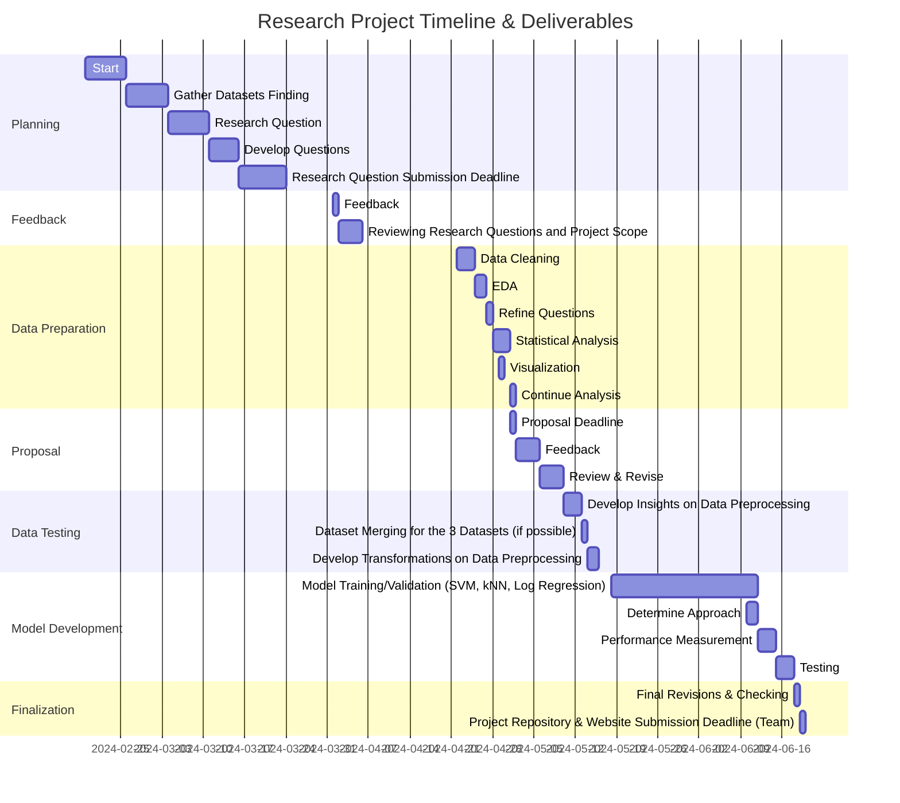

# Extended Research Proposal 

# Abstract
This research project delves into the complex interaction among economic circumstances, meat dietary behaviors, and health consequences across various global regions. By closely examining health data, income distributions, and meat consumption trends, the study aims to reveal the intricate relations contributing to differences in disease occurrence and mortality rates. The investigation seeks to offer a thorough understanding of how financial status and income differences impact health, highlighting inequalities in healthcare accessibility and disease burdens. Through precise examination, the project aims to address fundamental inquiries, such as the effects of meat preferences on longevity, and the potential association between air pollution and cancer incidence. By deciphering these multifaceted dynamics, the study's outcomes aspire to guide targeted initiatives in public health, optimize resource allocation, and foster enhanced global population health outcomes.

# Scope of the Project
The project focuses on investigating the effect of health statistics, income levels, and Meat dietary habits on the prevalence of infections and diseases leading to mortality across different regions globally. Specifically, it aims to analyze data to understand how socioeconomic factors contribute to health disparities and vulnerability to diseases. The scope includes examining various indicators such as healthcare access, income distribution, and dietary patterns to provide a holistic perspective on public health challenges.
Our project also aims to: 
- Understand how health statistics, income levels, and dietary options collectively influence regions' susceptibility to infections and diseases leading to mortality.
- Lead to insights into socioeconomic determinants of health, the impact of dietary patterns on disease prevalence, and the overall effectiveness of health infrastructure in different regions.
- Uncover disparities in disease burden, the effectiveness of healthcare interventions, and inform the prioritization of health resources based on region-specific health challenges.

# Research Questions
The main question we aim to approach is: _How can identifying health statistics, income statistics, and consumer MEat dietary options provide a broader perspective on regions that are more prone to infections and diseases resulting in mortality?”_

Additionally, the project aims to explore several other questions throughout the project, including but not limited to:

1. _What factors can contribute to the variations in Healthy Life Expectancy (HALE) at birth across different regions, countries, and levels of meat consumption?_
    + This question delves into the factors contributing to differences in healthy life expectancy at birth across various regions and countries. It explores how lifestyle, access to healthcare, environmental factors, and socioeconomic status impact HALE.
    + This research can uncover disparities in healthcare systems, lifestyle-related disease burdens, and policy implications for improving population health and longevity.
    + It also investigates whether there is a correlation between annual meat consumption and healthy life expectancy, exploring the impact of dietary habits on overall health and longevity.
2. _In areas with higher air pollution death rates, would it be logical to expect more occurrences of cancers?_
    + This question examines the potential correlation between air pollution levels and cancer rates, acknowledging the environmental influence on health outcomes.
    + Research findings can inform public health policies aimed at pollution control, cancer prevention strategies, and healthcare resource allocation based on environmental health risks.

# Methodolgy

## Data Preprocessing
Utilizing Jupyter Notebook, data preprocessing was performed on three main datasets identified as follows:

1. *World Health Statistics - Merged.ipynb*
2. *MeatConsumption-Preprocessing.ipynb*
3. *IncomeStats - Preprocessing.ipynb*

Each notebook aims to provide a comprehensive analysis of its respective dataset, ensuring that the preprocessing steps are well-documented and justified. The explanations and comments within the notebooks serve to enhance understanding and facilitate reproducibility of the preprocessing procedures.

1. Printed codes were utilized to display heads, info, column names, and dtypes, providing basic information on the data types. CSV files for world health statistics were merged. Additionally, merged_life_expectancy and merged_region_expectancy were combined as two separate entities due to differing locations—one was country-coded while the other was region-coded.

2. Missing values and duplicated rows were managed through merging, dropping, or imputation, depending on their significance and statistical descriptions. For instance, in the life expectancy data, missing values were checked, but no indication of their presence was found. In other cases, median values were employed for imputation where appropriate. Median imputation was specifically chosen due to its suitability for data with outliers, as the median is less influenced by extreme values compared to the mean. The preprocessing steps also included checking for and removing duplicate entries to prevent bias in the learning algorithms caused by training on repeated data.

3. While some outliers (such as NTDs) were not addressed in this step due to requiring further analysis, including more visualizations, transformations, or imputations, they were retained in their original state. Unnecessary columns were dropped, and certain variables, like the First Tooltip in some data frames, were numeric values that needed to be extracted from string fields using regular expressions—a crucial step in converting textual data into a format suitable for machine learning models.

4. Moreover, categorical variables were encoded, and training and testing splits were performed to prepare them for the subsequent model training step. Variables such as 'Location' and 'Indicator' were encoded using label encoding, converting categorical labels into numerical form without introducing a specific order to avoid increasing dimensionality.

5. Aside from the outliers issue, merging three datasets, as well as dataframes within the world health statistics dataset, seemed challenging.

6. Generation of charts and illustrations that possibly support or refute hypotheses or research questions. However, due to the size of the data and the numerous visuals, they have been generated in the respective notebooks accompanied by detailed explanations of the visuals and the corresponding results portrayed in them.
  + Some Examples:
    + 
      + + 
          
    + 
    + 
    + 

## Future works
The next step in our project involves determining whether the datasets can be merged. If not, we will proceed with training them separately and then conduct a combined analysis based on the outputs and models generated.

Following this, we will:

1. Gain additional insights through visualizations and data exploration to determine which necessary models, transformations, and feature scaling techniques should be applied.

2. Begin the model development phase, which includes model selection and training:
   - Choose appropriate machine learning models based on the data's nature and the specific health outcomes we aim to predict (such as mortality). Given the data's diversity (including mortality rates, health service access, etc.), models like logistic regression, random forests, and support vector machines could be considered. Transformation techniques, especially those targeting outliers, must be applied.
   - Utilize the training dataset to train using the best-fit models. The training process should be well-documented and repeated multiple times. Multiple models could be employed for comparison purposes (e.g., logistic regression, classification, etc.).

3. Evaluate the models and their training process thoroughly using validation techniques such as cross-validation, validation sets, and k-folds to assess how well they generalize to new, unseen data. After finalizing the model using the training and validation datasets, apply the model to a separate and untouched testing dataset to ensure unbiased performance evaluation. Evaluate the models using various performance metrics such as accuracy, precision, recall, F1 score, and AUC-ROC curves to determine their effectiveness in terms of error rate and balance between sensitivity and specificity. Aim for low train and test errors.

4. Use insights from the models to identify the most influential features in predicting the outcomes after training our data. This analysis can offer valuable insights into the factors driving health statistics like mortality rates or life expectancy.

5. Further refine the models by tuning hyperparameters to enhance their performance. This iterative process involves adjusting parameters such as learning rate, the number of trees in decision tree-based models, or kernel coefficients in SVMs.

# Datasets used
1. World Health Statistics 2020|Complete|Geo-Analysis

  + https://www.kaggle.com/datasets/utkarshxy/who-worldhealth-statistics-2020-complete

2. Global income statistics

  + https://www.kaggle.com/datasets/konradb/global-income-statistics 

3. Worldwide Meat Consumption

  + https://www.kaggle.com/datasets/vagifa/meatconsumption

# Project Timeline and Deliverables 

Team Name: _**The A Team**_

Team Members: 
- Ahmad Assali 120203007
- Derya Alp Balbay 120203055 
- Lana Dabbagh 120203092
- Masa Corky 119203005
- Ozan Aksu 120203015

